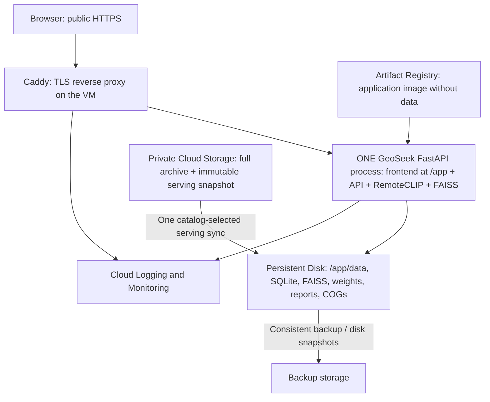

# GeoSeek on Google Cloud — deployment runbook

Prepared 2026-09-30 for project **geoseek-510206**, region **asia-south1 (Mumbai)**.
The user selected a **CPU Compute Engine VM with persistent disk** to preserve
SQLite writes. This is an explicit departure from the initial Cloud Run preference,
for persistence, not for GPU performance. No GPU is required or provisioned.

## Status and measurements

Deployment completed on 2026-09-30 with trial billing enabled. The public demo is
**https://geoseek.8.234.117.216.sslip.io/app/** and is open without application
authentication at the user's request. The VM is `geoseek-demo` (`e2-standard-2`)
and the application image is pinned to
`sha256:142a6b9dd0b0966d504cb9f933cded397938c022f8145504a2588b18554e0de9`.

Measured local filesystem, rather than estimated archive size:

| Item | Actual size |
|---|---:|
| `du -sh data/datasets/` (Git's bundled du on Windows) | 137G allocated |
| Dataset file lengths, 76,138 files | 145,898,432,683 bytes = 135.88 GiB |
| Existing `data/index/` | 318,226,016 bytes |
| `tiles.faiss` | 215,541,805 bytes; 105,245 vectors |
| `tiles.sqlite` | 95,887,360 bytes; 81 observations |
| Existing `data/models/` including evaluation caches | 1,299,137,671 bytes |
| RemoteCLIP ViT-B/32 weights | 605,208,421 bytes |
| Existing `data/change_model/` | 1,095,136,013 bytes |
| Existing `data/detections/` | 90,337,056 bytes |
| Portable serving snapshot, excluding imagery | 1.989 GiB / 710 files |
| SQLite-referenced serving imagery | 36,602,517,424 bytes = 34.09 GiB / 350 files |
| Final private GCS `datasets/` | 145,898,432,685 bytes / 76,139 objects (source plus 2-byte marker) |

The datasets directory also contains xView, DOTA and OSCD training material; it
is not exclusively production COGs. The private GCS archive preserves the whole
source directory. VM bootstrap reads the deployed SQLite catalog and syncs only
its 81 referenced imagery directories (350 files), so training-only data neither
delays future VM seeds nor consumes serving-disk space. It never reads the archive
into RAM. `data/detect_eval`, training runs, ZIP duplicates, and evaluation-only
model caches are not part of the portable application snapshot.

Local CPU benchmark (`benchmark-results.json`), two torch threads, 10 warm samples:

| Operation | Median | Maximum |
|---|---:|---:|
| RemoteCLIP text | 90.4 ms | 106.4 ms |
| RemoteCLIP synthetic RGB image | 137.7 ms | 179.1 ms |
| FAISS exact search across all persisted vectors | 17.3 ms | 19.3 ms |
| Trained FC-Siam-diff, synthetic 256x256 five-band pair | 217.2 ms | 227.5 ms |

Model load: 2.09 seconds. Peak RSS for both models plus index: 1,869,127,680
bytes (1.74 GiB). This is a Windows CPU microbenchmark, not a GCE load test,
not a full-scene change-analysis benchmark, and not a cloud p95 promise.

The real local CPU API smoke also passed (`smoke-results.json`): 6.67 s startup,
130 ms text request, 69 ms thumbnail and 88 ms candidate overlay in one sample.
It loaded 841 ranked candidates and four detection observations; frontend,
health/stats, cluster-map, audit and isolated decision/watch writes returned 200.
Those writes used a temporary SQLite copy, not the original catalog.

Validation: 92 passed, 3 skipped, 4 pre-existing frontend provenance failures
across the selected config/catalog/vector-index/frontend/search-parity tests.
Chart.js and Leaflet CSS/JS lack vendor allowlist entries; Three.js has CRLF
checkout bytes while its recorded hash matches LF-normalized bytes. Frontend
files and the original manifest were not edited to conceal these failures.
Shell syntax, Python compilation and Cloud Build source exclusions were checked.
Cloud Build succeeded, the digest-pinned image started, and Caddy obtained a valid
Let's Encrypt certificate for the public hostname.

The public cloud smoke test passed without disabling TLS verification: anonymous
access to `/app/`, health, RemoteCLIP/FAISS text search, a rasterio thumbnail,
a candidate change overlay, discovery cluster map and saved YOLO-OBB
observations returned 200. The final anonymous request sequence took 518 ms for
text search, 397 ms for a thumbnail, and 596 ms for an overlay. A labeled analyst
decision and watch area both remained after restarting the application container.
The full-archive no-op rsync exited 0; cloud bytes and object count exactly match
76,138 local files plus the 2-byte serving marker. The serving verifier separately
confirmed all 350 catalog-referenced files and 36,602,517,424 bytes.

**Start with e2-standard-2: 2 vCPUs / 8 GiB RAM.** The application is limited to
6 GiB, leaving 2 GiB for the OS, TLS proxy and monitoring. This gives substantial
headroom over the measured 1.74 GiB model/index footprint for Python metadata,
startup transients and existing thumbnail caches. Use one Uvicorn worker.
Use a **200 GiB pd-balanced data disk**. The active serving set is about 36 GiB
imagery plus 2 GiB of index/models/reports; the remaining capacity provides room
for outputs, snapshots staged in place and future catalog growth. Use a separate
30 GiB boot disk for OS/container layers and monitor both disks.

## Architecture and actual serving behavior



Caddy terminates HTTPS; it is not a separate frontend application. All HTML,
JS, API requests and imagery still reach the same FastAPI process and origin.
`api-client.js` retains `const BASE = ""`; no CORS changes.

The inspected code is more specific than the original proposed linear pipeline:

* Text query -> RemoteCLIP -> existing persisted FAISS -> SQLite metadata -> results.
* Tile/candidate imagery -> rasterio windowed reads of staged COGs -> image response.
* Candidate evidence is loaded from the existing ranked change reports and cached
  probability rasters. FC-Siam-diff and the five suppression gates run in the
  existing analysis pipeline, not automatically for each UI request.
* The detection tab reads saved YOLO26s-OBB observations. It does not rerun YOLO
  on each request. Only the deployed detector checkpoint/card is exported.

No new tiling, bulk per-query scanning, index rebuilding or runtime Hugging Face
download is introduced. Existing offline model loading uses the staged RemoteCLIP
checkpoint, originally from `chendelong/RemoteCLIP`. Training and refresh analysis
remain explicit maintenance activities, not container startup commands.

## Why synced disk instead of GCS FUSE / Cloud Run

Mounting a GCS bucket at `/app/data` would preserve path names, but GCS FUSE lacks
SQLite's required filesystem locking/transaction semantics. GCS is object storage,
not a live database disk. A Cloud Run startup copy would safely load an index but
would lose decisions/watch edits at instance replacement; max-instances=1 does not
fix this, including during revision overlap. NFS is not a drop-in SQLite solution.

The selected approach adds backward-compatible filesystem environment settings
and performs one catalog-selected GCS-to-Persistent-Disk sync. Local ext4 gives reliable
random COG window reads, SQLite locks and durable writes across restarts. GCS keeps
the archive independently of code and the VM. This costs a second storage copy and
initial download time; it avoids unpredictable FUSE seek latency and consistency
behavior for this demo. The sync does not recur on normal VM restarts.

For a later disposable/read-only Cloud Run demo, a read-only imagery-only FUSE
mount plus local startup copies of weights/index/catalog is viable after testing
window latency and cold-start time. It does not meet durable analyst-write needs
without an explicitly designed persistence layer, so no misleading Cloud Run
production deployment command is supplied here.

## Google Cloud services and privileges

| Service | Purpose |
|---|---|
| Compute Engine | One CPU VM, running the existing application image |
| Persistent Disk | Durable local filesystem and live SQLite; separate from VM boot disk |
| Cloud Storage Standard, Mumbai | Private archive and immutable initial serving snapshot |
| Artifact Registry | Private application Docker image |
| Cloud Build | Build the existing Dockerfile; local Docker daemon is currently stopped |
| IAM/service accounts | Keyless attached service identity; explicit resource-scoped permissions |
| Cloud Logging/Monitoring + Ops Agent | Container logs, CPU, RAM, disk and network |
| IAP + OS Login | SSH without opening TCP/22 to the internet |

Runtime identity receives objectViewer on the archive bucket, reader on the one
Artifact Registry repository, and project logWriter/metricWriter. It cannot
delete the archive or administer the project. Its former demo-secret access was
removed when the user requested anonymous public access.
The build identity is separate. A project owner/admin can run setup; ordinary
operators need Compute/Network administration, serviceAccountUser for the runtime
account, OS Admin Login and IAP tunnel access, scoped as narrowly as practical.
No Cloud SQL, Vertex AI, GPU, load balancer or separate frontend hosting is needed.

## Cost controls before deployment

This is **not an always-free deployment**. Mumbai e2-standard-2, 230 GiB of disks,
roughly 138 GiB GCS, external IPv4, builds, image storage, backups, logs and internet
egress consume trial credits. Free tier limits are inadequate for this footprint.
Check remaining credits/expiry in Billing and use the pricing calculator with
these measured quantities; do not assume an advertised US-region hourly price
is Mumbai pricing. As a conservative planning allowance, reserve roughly
US$100/month if left running continuously, then replace that allowance with the
calculator estimate before provisioning. This is not a price quote or spending cap.

Use only during demo hours; stop afterward. Disks, buckets and a reserved IP still
cost money while stopped. A project-scoped ₹1,000 alerts-only budget is configured
at 50/80/100%; check trial-credit usage daily. Budget alerts do not cap spend.
Do not purchase commitments or reserve GPUs for this deployment.

## 1. Local authentication and stage a portable snapshot (PowerShell)

Run in the existing project folder. Never send tokens/passwords in chat.

```powershell
Set-Location 'C:\Users\Prash\Downloads\SIH 2026\geoseek'
gcloud auth login
gcloud config set project geoseek-510206
gcloud projects describe geoseek-510206 --format='value(projectId)'
gcloud billing projects describe geoseek-510206 --format='value(billingEnabled)'
# Must print True before continuing.
```

Stop ingestion/index writes before creating a release so FAISS and SQLite refer
to the same catalog generation. The current `data/cloud-release` is already
prepared. To create a later release use a NEW output directory:

```powershell
conda activate geoseek
python deploy/gcp/prepare_release.py --output data/cloud-release-next
```

`prepare_release.py` uses SQLite's backup API, checks integrity, copies the existing
FAISS bytes, exports required serving artifacts, rewrites paths only in the copy,
and produces SHA-256 checksums. It does not rebuild embeddings/indexes or rewrite
the original reports/database. The model checkpoint and source URLs retain their
provenance, with deployment rebasing recorded in `release-manifest.json`.

## 2. Create APIs, storage and identities (PowerShell)

These commands create billable infrastructure. Run each block successfully before
continuing; do not blindly rerun resource creation after a partial failure.
Choose globally unique bucket names if these are already taken.

```powershell
$Project = 'geoseek-510206'
$Region = 'asia-south1'
$Bucket = "$Project-archive"
$BuildBucket = "$Project-build-source"
$RuntimeSA = "geoseek-runtime@$Project.iam.gserviceaccount.com"
$BuildSA = "geoseek-build@$Project.iam.gserviceaccount.com"
gcloud services enable compute.googleapis.com storage.googleapis.com artifactregistry.googleapis.com cloudbuild.googleapis.com iam.googleapis.com logging.googleapis.com monitoring.googleapis.com iap.googleapis.com oslogin.googleapis.com --project=$Project
gcloud storage buckets create "gs://$Bucket" --location=$Region --uniform-bucket-level-access --public-access-prevention --project=$Project
gcloud storage buckets create "gs://$BuildBucket" --location=$Region --uniform-bucket-level-access --public-access-prevention --project=$Project
gcloud artifacts repositories create geoseek --repository-format=docker --location=$Region --project=$Project
gcloud iam service-accounts create geoseek-runtime --project=$Project
gcloud iam service-accounts create geoseek-build --project=$Project
gcloud storage buckets add-iam-policy-binding "gs://$Bucket" --member="serviceAccount:$RuntimeSA" --role=roles/storage.objectViewer
gcloud storage buckets add-iam-policy-binding "gs://$BuildBucket" --member="serviceAccount:$BuildSA" --role=roles/storage.objectViewer
gcloud artifacts repositories add-iam-policy-binding geoseek --location=$Region --member="serviceAccount:$RuntimeSA" --role=roles/artifactregistry.reader --project=$Project
gcloud artifacts repositories add-iam-policy-binding geoseek --location=$Region --member="serviceAccount:$BuildSA" --role=roles/artifactregistry.writer --project=$Project
gcloud projects add-iam-policy-binding $Project --member="serviceAccount:$BuildSA" --role=roles/logging.logWriter
gcloud projects add-iam-policy-binding $Project --member="serviceAccount:$RuntimeSA" --role=roles/logging.logWriter
gcloud projects add-iam-policy-binding $Project --member="serviceAccount:$RuntimeSA" --role=roles/monitoring.metricWriter
```

## 3. Upload data once (PowerShell)

Allow enough time/uplink capacity for approximately 138 GiB. Rerunning rsync after
interruption resumes by comparing files; no deletion flags are used. GCS stays private.

```powershell
gcloud config set storage/parallel_composite_upload_enabled False
gcloud storage rsync --recursive data/datasets "gs://$Bucket/datasets"
# Rerun the same command after any interrupted/erroring pass. It is idempotent.
python deploy/gcp/verify_serving_upload.py
# Create only after that verifier confirms all 81 SQLite-referenced directories.
'' | gcloud storage cp - "gs://$Bucket/datasets/.serving-upload-complete"
gcloud storage rsync --recursive data/cloud-release "gs://$Bucket"
```

Bucket layout matches actual serving paths, plus discovery and provenance:

```text
datasets/       # full source archive, never in image
index/          # tiles.faiss, tiles.sqlite, tile_clusters.json, spectral CSV
models/         # RemoteCLIP and deployed detector checkpoint/card only
change_model/   # FC-Siam-diff weights, cached probability COGs, ranked reports
detections/     # stored detector observations and evidence
discovery/      # cluster map and associated artifacts
provenance_manifest.json
release-manifest.json
```

Do not rerun the bootstrap seed against a live database. After the first seed,
the Persistent Disk catalog is authoritative for analyst edits. Publishing a new
catalog requires an explicit maintenance migration/merge and backup.

## 4. Build and push using the existing Dockerfile (PowerShell)

`pyproject.toml` remains the dependency manifest. CPU torch/torchvision are installed
from the CPU wheel index; native libraries and editable dependency layer ordering
are preserved. `detect` remains an optional extra and is enabled here to preserve
the existing image. Ultralytics/weights are AGPL-3.0: retain the existing licensing
notice and assess your source-distribution obligations for a public service.

```powershell
$Image = "$Region-docker.pkg.dev/$Project/geoseek/app:demo-20260930"
gcloud meta list-files-for-upload
# Review: no data/, .env, credentials, weights, indexes, or private keys.
gcloud builds submit . --config=deploy/gcp/cloudbuild.yaml --substitutions="_IMAGE=$Image" --service-account="projects/$Project/serviceAccounts/$BuildSA" --gcs-source-staging-dir="gs://$BuildBucket/source" --project=$Project
gcloud artifacts docker images describe $Image --format='value(image_summary.digest)'
# Record the successful build ID and sha256 image digest.
```

Cloud Build performs `docker build` and pushes the image. It does not need the
local Docker daemon. If building locally instead, start Docker Desktop first:

```powershell
gcloud auth configure-docker "$Region-docker.pkg.dev"
docker build --build-arg GEOSEEK_EXTRAS=detect -t $Image .
docker push $Image
```

The baseline dependency ranges are not a reproducible lockfile. Retain and deploy
the validated image by digest; do not rebuild a moving tag during a demonstration.
For a later release, lock and audit dependency versions after container validation.

## 5. Provision the VM and HTTPS (Google Cloud Shell, Bash)

Open https://console.cloud.google.com/cloudshell/editor?project=geoseek-510206.
Cloud Shell includes Docker and gcloud. Download the exact source from your
successful Cloud Build so uncommitted deployment changes are included:

```bash
export PROJECT=geoseek-510206 REGION=asia-south1 ZONE=asia-south1-a
export GCS_BUCKET=$PROJECT-archive MODEL_BUCKET=$PROJECT-archive SATELLITE_DATA_PREFIX=datasets
gcloud config set project "$PROJECT"
export BUILD_ID='PASTE_SUCCESSFUL_BUILD_ID'
SOURCE_BUCKET=$(gcloud builds describe "$BUILD_ID" --format='value(source.storageSource.bucket)')
SOURCE_OBJECT=$(gcloud builds describe "$BUILD_ID" --format='value(source.storageSource.object)')
mkdir -p ~/geoseek-deploy
cd ~/geoseek-deploy
gcloud storage cp "gs://$SOURCE_BUCKET/$SOURCE_OBJECT" /tmp/geoseek-source.tgz
tar -xzf /tmp/geoseek-source.tgz -C ~/geoseek-deploy
export IMAGE="$REGION-docker.pkg.dev/$PROJECT/geoseek/app@sha256:PASTE_IMAGE_DIGEST_WITHOUT_SHA256_PREFIX"
```

The demo is intentionally public without an application login. Anyone with the
URL can use write endpoints such as analyst decisions and watch areas. For a
controlled or long-lived deployment, add Identity-Aware Proxy or an application
identity layer before distributing the URL.

```bash
bash deploy/gcp/provision.sh
```

The provisioning script creates a dedicated VPC/subnet, permits public TCP 80/443
(80 is needed for certificate challenges/redirect), permits SSH only via IAP,
reserves an IP, attaches a non-auto-deleted data disk, and installs the startup
script. Port 8000 binds only to VM loopback. No GPU or CUDA component is installed.

The startup script formats only the explicitly named blank new data disk, syncs
the non-imagery snapshot, derives the required imagery directories from the
deployed SQLite catalog, verifies snapshot hashes and SQLite integrity, and starts
the single application worker plus Caddy. It does not copy training-only archives.

Without a purchased domain, the demo hostname is `geoseek.<IP>.sslip.io`, using
third-party wildcard DNS and Caddy's automatic public HTTPS. This is a demo
convenience, not an owned long-term domain. DNS availability and CA rate limits
can delay issuance. For a domain you own, set `DEMO_HOST=demo.example.com` before
provisioning, point its A record at the reserved IP before certificate issuance,
and use that hostname in the Caddyfile. Do not accept a self-signed certificate
as successful public HTTPS. A Cloud Run `run.app` URL is not available for a VM.

## 6. Verify and obtain the final URL

```bash
IP=$(gcloud compute addresses describe geoseek-ip --region=asia-south1 --format='value(address)')
echo "https://geoseek.$IP.sslip.io/app/"
gcloud compute instances get-serial-port-output geoseek-demo --zone=asia-south1-a
gcloud compute ssh geoseek-demo --zone=asia-south1-a --tunnel-through-iap
# The following commands run inside the VM:
sudo tail -n 60 /var/log/geoseek-bootstrap.log
sudo docker ps
curl --fail http://127.0.0.1:8000/health
curl --fail http://127.0.0.1:8000/stats
sudo docker stats --no-stream
df -h /srv/geoseek /
```

From Cloud Shell, test the public endpoint without `-k`:

```bash
curl --fail "https://geoseek.$IP.sslip.io/health"
curl --fail "https://geoseek.$IP.sslip.io/search/text?q=river&k=3"
```

Open `/app/`, search, render thumbnails, open an overlay, inspect a detection
tile, download the cluster map, create a watch and record a decision. Restart
the container and verify the watch/decision survives. `/health` alone is not
enough: the API intentionally tolerates a missing analyst report, so check
`/stats`, candidate counts, imagery and detection endpoints too.

The repository includes `deploy/gcp/public_smoke.py` for these read-only public
checks. It verifies that the UI and representative APIs work anonymously over
certificate-validated HTTPS.

Repeat CPU benchmark inside the deployed container and measure browser p50/p95
at 1 then 2 simultaneous users. Keep p95 text requests below a demo target of
2 seconds and imagery below 3 seconds; these are acceptance targets, not measured
GCE results. If CPU is saturated, try 4 vCPUs before considering GPU. Run full
refresh analysis separately during maintenance after measuring its memory needs.

## Persistence, backups, updates and scaling

The SQLite file, models/index, reports, imagery and Caddy certificate state are
on the data disk. `.seed-complete` prevents repeated downloads and overwriting
live analyst edits. Docker restarts use the same files. No shutdown upload is
required for durability. A Persistent Disk is not by itself a backup.

For a consistent full-disk backup, stop the VM before snapshotting (Cloud Shell):

```bash
gcloud compute instances stop geoseek-demo --zone=asia-south1-a
gcloud compute disks snapshot geoseek-data --zone=asia-south1-a \
  --snapshot-names="geoseek-data-$(date -u +%Y%m%d-%H%M%S)"
gcloud compute instances start geoseek-demo --zone=asia-south1-a
```

Take a snapshot before updates and after a demo with important edits. Snapshot
charges are additional. To restore, stop the VM, create a NEW disk from the chosen
snapshot, detach the old disk without deleting it, attach the restored disk as
device-name `geoseek-data`, and start the VM. Verify known decisions/watch areas.
Never copy an actively written SQLite file with plain `cp`; use its backup API
or a stopped-VM snapshot. Do not replace live SQLite with the original GCS seed.

For image updates: snapshot first; change instance `geoseek-image` metadata to
the new validated digest; stop/remove only the GeoSeek application container
(never the data volume), then rerun the startup script. The script deliberately
does not replace an already-existing container automatically. Verify all UI
paths and stored edits. Roll back by recreating the container with the prior
digest; do not roll back the database unless schema compatibility requires a
planned restore. Pin the tested Caddy image digest too before a long-lived rollout.

Current scaling is vertical and one writer: increase VM CPU/RAM/disk as measured.
Do not launch multiple independent writers against copied SQLite databases or
put SQLite on GCS FUSE. Horizontal writable scaling requires a future repository
backend/replication design and is not achieved by this deployment. The existing
repository interface is a natural future migration boundary. This demo is not HA.

## Monitoring and troubleshooting

Cloud Logging receives app and Caddy container output. Caddy JSON access logs
contain request duration; make p50/p95 latency charts/log-based metrics by path
without logging request bodies or credentials. `/search/text` already reports
`latency_ms`; the benchmark separates embedding/FAISS/FC-Siam timings. Ops Agent
provides guest memory, disk and network metrics in addition to VM CPU. Alert on
memory >80%, data/boot disk >80%, sustained CPU >85%, 5xx and failed uptime checks.
The Docker `gcplogs` driver may not support `docker logs`; use Logs Explorer if
it reports that limitation.

GCS is accessed at initialization, not per request, on this chosen architecture.
Record sync elapsed time/bytes and monitor Storage request errors/latency during
provisioning. Request-time imagery storage latency is local disk I/O: compare
cold/warm image requests, Ops Agent disk latency/throughput and raster window
timing. Cloud Run alternatives would require Cloud Run CPU/memory/request latency
charts plus custom GCS/window timings and cache bounds; Cloud Run's writable
filesystem consumes memory and is ephemeral, not persistent disk.

| Symptom | Checks and remedy |
|---|---|
| GDAL/rasterio import or libGL failure | Use the existing image native libraries; inspect `docker exec geoseek python -c 'import rasterio,cv2; print(rasterio.__version__)'`. Do not randomly mix apt GDAL/Python GDAL versions with rasterio wheels. Check the file path, COG format and CRS/PROJ data in the container. Local conda GDAL warnings do not prove the Linux image is broken. |
| GCS 403 / missing file | Check VM attached service account, bucket-level objectViewer, exact prefix/case, IAM propagation and active project. Do not make the bucket public or upload a key file. |
| Startup not complete | Inspect serial output and `/var/log/geoseek-bootstrap.log`; the 34.09 GiB catalog-selected first seed can take several minutes. Check mount, sync progress, SHA-256 check and free space. Normal reboot must find `.seed-complete`. |
| Container exits | Check Cloud Logging, image digest/platform, CPU torch/torchvision compatibility, writable `/app/data`, SQLite integrity, and that port 8000 is local-only behind Caddy. |
| Missing/model-load failure | Confirm `MODEL_PATH`, exact checkpoint, manifest checksum and RemoteCLIP architecture. Offline mode forbids fallback downloads. FC-Siam requires its trusted staged checkpoint and compatible torch version; never bypass load checks using an untrusted weight file. |
| No candidates or missing overlay/detection | Ensure change_model, discovery, detections and provenance were uploaded; use the portable release, not the raw Windows SQLite/report paths. Check absolute Maxar paths and full ranked detail rather than silently accepting only top candidates. |
| Out of memory | Compare `docker inspect` OOM status, guest RAM and container limit. Keep one worker, limit concurrent users, check existing thumbnail caches and avoid full-scene analysis while serving. Increase RAM based on measured peak; do not sync archive into Cloud Run RAM. |
| Slow imagery | Ensure reads use `/srv/geoseek/app-data/datasets`, not a remote/FUSE path. Measure a COG window and disk latency, cold/warm cache, CPU contention and available disk throughput. No retiling or full-archive load is needed. |
| HTTPS unavailable | Check public DNS, port 80/443 firewall, Caddy logs, CA rate limits and VM clock. Use a domain you own if wildcard DNS/certificate issuance fails. Keep cert state persistent. |
| Build denied | Check build SA objectViewer on source bucket, Artifact Registry writer, logWriter and the caller's serviceAccountUser permission. |
| Billing/quota error | Link the trial billing account, verify trial eligibility and Mumbai E2/disk/external-IP quota. Do not silently upgrade the billing account. |
| Stop/start | `gcloud compute instances stop geoseek-demo --zone=asia-south1-a`; use `start` before the next demo. Persistent storage/IP charges remain while stopped. |

GPU/CUDA troubleshooting is intentionally omitted: this is a CPU deployment.

## File-by-file change justification

| File | Exact purpose and effect |
|---|---|
| `src/geoseek/config.py` | Optional filesystem path environment settings and SQLite URL validation. Original paths remain defaults; no network I/O added. |
| `src/geoseek/search/engine.py` | Uses configured FAISS/database paths when no explicit index_dir is passed. Explicit directories still win; load-once behavior unchanged. |
| `src/geoseek/ingest/store.py` | Same path precedence for index/catalog writers so ingest and serving cannot silently diverge. No index rebuild added. |
| `src/geoseek/ingest/embed.py` | Reads checkpoint from configured MODEL_PATH; same loading/embedding algorithm. |
| `src/geoseek/catalog/sqlite_repository.py` | Default catalog uses configured database path; explicit connections/paths unchanged. |
| `src/geoseek/catalog/migrate.py` | Migration defaults follow DATABASE_URL; explicit --db still wins. |
| `src/geoseek/analyst/service.py` | Standalone repository follows configured catalog path; analyst logic unchanged. |
| `src/geoseek/change/analyze.py` | Catalog discovery/analysis use the configured database; five gates and FC-Siam pipeline unchanged. |
| `src/geoseek/temporal/matcher.py` | Default catalog path uses the same configuration; matching unchanged. |
| `src/geoseek/staging/download_sentinel1.py` | Staging metadata lookup uses configured catalog; download logic unchanged. |
| `Dockerfile` | Retains native libraries/editable install/CPU wheel source; installs matching CPU torchvision, configurable optional extra, one worker, PORT support, offline model environment. Corrects misleading claim that --gpus enables a CPU wheel. |
| `docker-compose.yml` | Keeps one service and existing data bind mount; explicit CPU/two-thread defaults, removes misleading GPU snippet. |
| `.dockerignore` | Excludes env/secrets/key patterns in addition to existing data exclusion. |
| `.gitignore` | Excludes actual env files, generated deployment snapshot and large data ZIPs; preserves `.env.example`. No data deleted. |
| `.gcloudignore` | Reuses Docker exclusions so Cloud Build source upload also excludes imagery/secrets. |
| `.gitattributes` | Keeps Linux shell deployment scripts LF on Windows checkout. |
| `.env.example` | Documents deployment bucket/prefix variables and application path settings; no credentials. |
| `deploy/gcp/prepare_release.py` | Offline deployment-copy export, SQLite backup, Windows-path rebasing, checksums. Originals unchanged. |
| `deploy/gcp/cloudbuild.yaml` | Builds/pushes the existing Dockerfile using a separate build identity. |
| `deploy/gcp/provision.sh` | Creates the chosen CPU VM, network, attached disk and demo hostname. |
| `deploy/gcp/bootstrap-vm.sh` | One-time catalog-selected serving seed/checksums, persistent mount, pinned image launch, public HTTPS proxy, monitoring. |
| `deploy/gcp/benchmark.py`, `benchmark-results.json` | Reproducible local CPU evidence; synthetic patch limitations documented. |
| `deploy/gcp/smoke.py`, `smoke-results.json` (on success) | Real API/imagery smoke using a disposable DB copy; no original analyst edits. |
| `deploy/gcp/verify_serving_upload.py` | Confirms every SQLite-referenced imagery file exists in GCS with the expected size before publishing the serving marker. |
| `deploy/gcp/public_smoke.py` | Read-only, TLS-validating test of the public UI, search, imagery, change, discovery and detection paths. |
| `deploy/gcp/persistence_smoke.py` | Creates labeled demo records and verifies them after a deliberate container restart. |
| `tests/test_cloud_config.py` | Defaults, overrides, SQLite-only validation and path rebasing regression checks. |
| `deploy/gcp/README.md` | This architecture, commands, limits, monitoring and troubleshooting runbook. |

`src/geoseek/search/api.py`, all frontend files, matching/ranking logic, model
architectures and suppression gates remain unchanged. No Oriented R-CNN,
transformers, GeoPandas or new runtime cloud SDK dependency was added to Python.

## References

* [Cloud Storage FUSE limits](https://docs.cloud.google.com/run/docs/configuring/services/cloud-storage-volume-mounts)
* [Cloud Run filesystem/memory contract](https://docs.cloud.google.com/run/docs/container-contract)
* [Compute VM pricing](https://cloud.google.com/products/compute/pricing/general-purpose)
* [Free trial and free tier](https://cloud.google.com/free)
* [Alerts-only budgets](https://docs.cloud.google.com/billing/docs/how-to/budgets)
* [Ops Agent metrics](https://docs.cloud.google.com/monitoring/agent/ops-agent)
* [Caddy automatic HTTPS](https://caddyserver.com/docs/automatic-https)
* [sslip.io demo DNS](https://sslip.io/)
