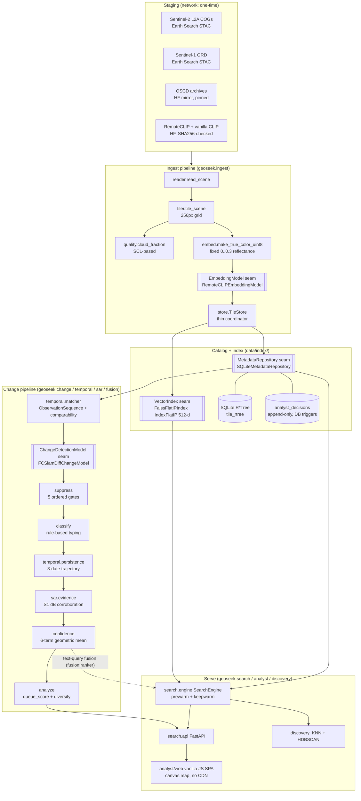

# geoseek — Architecture

A single-node, **offline** system that indexes a satellite-image archive, serves
semantic text/image retrieval and spatial queries over it, and runs a
multi-stage temporal change-detection pipeline. This document describes the
**current build** (as measured in `docs/EVALUATION_REPORT.md`). The final
section, [Future work](#future-work), lists design paths that are **not** part of
the current build and are marked as such.

Guiding constraints, all still true today:

* **Offline after staging.** Every capability runs with the network down once
  data is on disk. No CDN, no web-map tiles, no web fonts, no external API at
  serve time.
* **Four seams.** No application code imports `sqlite3` or `faiss` outside the
  two modules that *are* those seams. Storage and the vector index are
  swap-points, not assumptions baked through the codebase.
* **Provenance is not optional.** Every tile carries its full upward chain
  (tile → observation → scene → collection); every model and dataset is
  SHA256-pinned; every analyst decision is written to an append-only audit table
  enforced at the storage layer.

---

## 1. Component diagram



**Reading it:** staging fills `data/datasets/` and `data/models/` once (needs
network). Everything below the dashed line runs offline. The ingest pipeline is a
straight `read → tile → quality → true-colour → embed → store` line; `TileStore`
is a thin coordinator that writes the catalog row through `MetadataRepository`
and the vector through `VectorIndex`. The search engine composes those two seams
plus the embedding model. The change pipeline is a separate, offline,
batch-style flow that reads band rasters directly and drives the trained
`ChangeDetectionModel` through the same `ObservationPair` contract the temporal
matcher emits.

---

## 2. Data model — Collection → Scene → Observation → Tile

`src/geoseek/catalog/entities.py` — plain frozen dataclasses, **no** `sqlite3` /
`faiss` / driver import. All geometry is WKT in EPSG:4326. The repository layer
maps these to and from rows; a PostGIS implementation would map the *same*
objects.

| entity | is | key | example | carries |
|---|---|---|---|---|
| **Collection** | a source image collection | `collection_id` | `sentinel-2-l2a` | sensor, platform, band list, native GSD |
| **Scene** | one source product as the provider published it | `scene_id` | `S2B_44RPQ_20190330_1_L2A` | footprint, acquisition time, processing baseline, **source URL, licence, per-band SHA256** |
| **Observation** | a scene ∩ our AOI at one acquisition time | `observation_id` | `S2B_44RPQ_20190330_1_L2A_scaled` | AOI-clipped footprint, `aoi_name`, `dataset_dir` (the folder under `data/datasets/`), quality summary, **radiometry + co-registration params actually used** |
| **Tile** | a 256 px tile of one observation | `tile_id` | `…_r014_c005` | row/col, WKT geom, cloud fraction, **`faiss_id`** (vector id, or `NULL` if not embedded), `indices_ref`, processing history |
| **DerivedProduct** | a per-observation / per-tile raster or table, referenced **by path** (never blobbed) | `derived_id` | NDVI/NDWI/NDBI `.tif`, per-tile index CSV, thumbnail | `kind`, `path`, params |
| **AnalystDecision** | one append-only confirm/reject (PS 2.2.5) | `decision_id` | | decision, note, analyst, timestamp, **model_version + weights_sha256 + git_commit + pipeline_version + confidence_at_decision + full evidence blob** |
| **TileProvenance / TileRecord** | a tile with its whole upward chain projected on | `tile_id` | | tile → observation → scene → collection, flattened |

Why the extra "observation" layer between scene and tile: the same **scene** can
be clipped to different AOIs, re-registered against different references, or
re-processed; each of those is a distinct **observation** with its own
radiometry / co-registration record, but they share one **scene**'s provenance
(URL, licence, checksums). The Ayodhya change work needs exactly this — three
observations (2019 / 2021 / 2024), each with its own PIF-offset and co-reg
residual vs the 2024 reference, all pointing back to their real product ids.

Physical layout:

```
data/
  datasets/<observation_id>/         band GeoTIFFs (B02 B03 B04 B08 B11 SCL) + NDVI/NDWI/NDBI.tif
  models/                            RemoteCLIP-ViT-B-32.pt, vanilla OpenCLIP cache
  index/
    tiles.sqlite                     the catalog (+ tile_rtree virtual table + analyst_decisions)
    tiles.faiss                      the 512-d IndexFlatIP vector store
    spectral_indices_per_tile.csv    per-tile NDVI/NDWI/NDBI summary
  change_model/                      fc_siam_diff.pt + norm_stats + per-pair probability rasters + reports
  provenance_manifest.json           every staging/analysis run's provenance (gitignored; regenerable)
```

---

## 3. The four seams

Each seam is a small ABC with one production implementation. Swapping an
implementation touches **no caller**. `grep -rn "import sqlite3\|import faiss"
src/` returns only the two seam modules + the schema-tool `catalog/migrate.py` + `catalog/embedding_map.py`
(Phase 9: the mapping database of a re-embedded candidate index; it never touches the production schema).

### 3.1 `MetadataRepository` — the catalog swap-point

`src/geoseek/catalog/repository.py` (ABC) · `catalog/sqlite_repository.py`
(`SQLiteMetadataRepository`, the **only** `import sqlite3` besides the migration
tool).

* Takes and returns the plain `entities`, **never** rows, cursors, or SQL.
* Spatial filters are expressed as **bbox / point arguments evaluated in
  Python**, not backend geometry predicates — so the interface is
  storage-neutral. `query_tiles(bbox=…)` probes a **SQLite R\*Tree**
  (`tile_rtree`, one bbox per tile, DDL kept *out* of the standard `SCHEMA_SQL`
  so that stays PostGIS-portable) for candidate rowids, then still runs the
  exact shapely `.intersects()` post-filter → byte-identical results, O(1)-ish
  instead of O(N) (§3.2 of the evaluation report: 837× on the bbox path).
  Falls back to the full scan if a SQLite build lacks the R\*Tree module.
* The **analyst audit trail** is reached only through this interface —
  `record_analyst_decision` is INSERT-only; there is no update or delete method
  on the ABC *by design*, and `schema.py` adds `BEFORE UPDATE` / `BEFORE DELETE`
  triggers that `RAISE(ABORT)` so append-only is enforced at the storage layer,
  not just by convention.

### 3.2 `VectorIndex` — the embedding-search swap-point

`src/geoseek/vectorindex/base.py` (ABC) · `vectorindex/faiss_flat.py`
(`FaissFlatIPIndex`, the **only** `import faiss`).

* Wraps a brute-force FAISS `IndexFlatIP` — **exact** cosine on unit-norm
  vectors, no recall/latency trade-off, zero tuning.
* **Append-only, positional ids.** `add(vectors)` returns the ids it assigned
  (0, 1, 2, … = insertion order); callers persist that id on `tiles.faiss_id`.
  `delete()` **raises `NotImplementedError`** — deleting from a positional flat
  index would renumber every later id and break the tile↔vector mapping. The
  method is on the ABC so a future id-mapped / HNSW index can support deletion
  without a signature change.
* `reconstruct_all()` bulk-reads the whole `(n, 512)` matrix for batch jobs
  (clustering) via `faiss.reconstruct_n` (< 0.1 s for 101,911); the ABC default
  loops `get_vector`.
* `validate(expected_count, expected_dim)` cross-checks the index against the
  catalog — the migration verifier and the search-engine refresh both call it.

### 3.3 `EmbeddingModel` — the encoder swap-point

`src/geoseek/models/base.py` (ABC) · `models/remoteclip.py`
(`RemoteCLIPEmbeddingModel`, wrapping `ingest/embed.py`).

* `encode_text(str) → (512,) unit-norm` and `encode_image` /
  `encode_images(list, batch_size)` → `(N, 512) unit-norm`. Text and imagery
  land in the **same** space, so cosine similarity is the inner product and the
  vector index is `IndexFlatIP` with nothing else.
* Production model is **RemoteCLIP ViT-B/32, used as-is, zero fine-tuning**. The
  vanilla OpenAI CLIP control (evaluation only) implements the same ABC and is
  loaded with `force_quick_gelu=True`.
* `load()` makes the model resident before the first call; the search engine
  calls it at boot (`_prewarm`) and every 20 s (`_keepwarm`) so served queries
  hit the ~17 ms warm path, not the ~235 ms cold encoder.

### 3.4 `ChangeDetectionModel` — the change-detector swap-point

`src/geoseek/models/base.py` (ABC) · `change/models/fc_siam_diff_model.py`
(`FCSiamDiffChangeModel`).

* Consumes an `geoseek.temporal.contract.ObservationPair` **exactly as the
  temporal matcher emits it** — `pair.earlier` / `pair.later` carry the full
  provenance chain, the AOI footprint, and the per-observation radiometry /
  co-registration params; `pair.comparability` says whether (and why) the pair
  is safe to compare. **No reshaping at the boundary.**
* An implementation **must** refuse (confidence 0, reason in `notes`) when
  `pair.comparable` is `False`.
* Returns a `ChangeResult`: per-tile change score + label, a **georeferenced
  full-AOI change mask written to disk** (referenced by path, not blobbed),
  and a confidence. `infer_probability_raster()` returns the un-thresholded
  per-pixel probability for the downstream suppression pipeline to build
  candidates on.
* Only imports torch / numpy / rasterio + the catalog entities — it does **not**
  touch `sqlite3` or `faiss` (the repository / vector-index seams are
  untouched).

---

## 4. Data flow

### 4.1 Query — text or image retrieval

```
text query ──► EmbeddingModel.encode_text ──► (512,) unit-norm
                                                  │
                              VectorIndex.search(q, n)   ◄── exact IndexFlatIP inner product
                                                  │
                       SearchEngine._rank_and_filter(scores, ids, filters)
                                                  │  (asks FAISS for n, not k, so metadata
                                                  │   filters can't shrink the result below k)
                       MetadataRepository row lookup per hit ──► provenance projected on
                                                  │
                                          top-k SearchResult[]  ──► FastAPI ──► SPA canvas map
```

Image queries are identical with `encode_image`. "More like this" from a map
click resolves the seed tile via `query_tiles(bbox=…)` (R\*Tree, ~1 ms) then
runs the same tile-seeded KNN.

Spatial-only queries (`query_tiles(bbox / date / sensor / max_cloud)`) never
touch FAISS — they go bbox→R\*Tree→exact shapely post-filter and stay flat with
scale (~0.3 ms at 100k tiles).

### 4.2 Change analysis — one observation pair

```
TemporalObservationMatcher.match(location, all_pairs=True, collection="sentinel-2-l2a")
        │  ObservationSequence: time-ordered observations + per-pair PairComparability
        ▼
FCSiamDiffChangeModel.infer_probability_raster(pair)  ──► cached prob_<pair>.tif  (~35 s / pair)
        │
        ▼  connected components of (p ≥ 0.80) & valid       [analyze.label_change / extract_candidates]
raw candidates
        │
        ▼  suppress.suppress_candidate — 5 ordered gates, each records a RuleOutcome:
        │     1 quality (bad-SCL >5% either date, or valid <80%)          → SUPPRESS
        │     2 registration (co-reg residual, 0.30→0.50 px linear)       → DOWN-WEIGHT
        │     3 radiometric (index-band inter-date corr <0.60 / low-conf) → DOWN-WEIGHT
        │     4 phenology (NDVI+NDBI+NDWI deltas all within their         → SUPPRESS
        │        scene-wide seasonal bands — anomaly-framed)
        │     5 morphology (component area < 50 px / 0.5 ha)              → SUPPRESS
        ▼
survivors ──► classify.classify_candidate  (rule-based typing on index ANOMALIES:
        │      construction / clearance / water_gain / water_loss / road / other)
        ▼
        ├─► temporal.persistence.trajectory_for_location  (samples the 3 cached prob rasters;
        │      persistent / progressive / recent / transient / inconsistent / single_pair / none;
        │      earliest-supported-change window + the "cannot claim earlier than 2019-03-30" caveat)
        │
        ├─► sar.evidence  (co-located S1 dB change → confidence factor in [0.80, 1.10]; weight only)
        │
        ▼
confidence.compute_confidence  ── 6 terms {model, persistence, spectral, quality, registration,
        │                          radiometric}, weighted GEOMETRIC mean, then × suppression
        │                          down-weight × persistence penalty × SAR factor
        ▼
analyze:  queue_score = confidence^0.65 · significance^0.35   ──► rank
          diversify (≤3 per change_type, ≥1.5 km spacing)     ──► headline top-N
          ──► ayodhya_change_report.json + ranked.csv + ranked_detail.json + panels
          ──► (optional) fusion.ranker re-ranks by a fused change + RemoteCLIP text-query score
```

`docs/EVALUATION_REPORT.md` §9 is the measured ablation of each of those stages.

### 4.3 Analyst review

`search/api.py` mounts the FastAPI app; `analyst/service.py` serves
`/candidates`, `/candidates/{id}` (full evidence + suppression trace +
trajectory + provenance chain + SAR), `/candidates/{id}/imagery` (PNG,
2019/2021/2024 × rgb/overlay), `/candidates/{id}/decision` (POST → append-only
`analyst_decisions`), `/audit`, `/export` (GeoJSON with full per-feature
provenance), `/discovery/{clusters,similar}`. The frontend
(`analyst/web/`, vanilla JS/CSS, an HTML5 `<canvas>` map in EPSG:4326 with a
lon/lat graticule) is served by the same process — no npm build, no CDN, no web
fonts.

---

## 5. Index build and incremental ingestion

### 5.1 First build

```
python -m geoseek.ingest.pipeline ingest <observation_dir>
```

Per scene, in `ingest_scene()`:

1. `reader.read_scene` — read B04/B03/B02 + SCL for the observation.
2. `tiler.tile_scene` — 256 px grid; partial edge tiles kept; a tile is skipped
   only when **every** pixel is nodata.
3. Pass 1 (CPU): `quality.cloud_fraction` per tile (SCL bad-class fraction) +
   `embed.make_true_color_uint8` with **fixed `[0, 0.3]` reflectance bounds**
   (same stretch for every tile and date — the analysis path never uses a
   per-tile percentile stretch; that is a display-only concern in
   `analyst/imagery.py`).
4. Pass 2 (GPU): `EmbeddingModel.encode_images(rgb_list, batch_size=64)` — a
   handful of batched forward passes, VRAM bounded regardless of scene size.
5. `TileStore.add_tiles(records, …)` → `MetadataRepository.add_tiles` (catalog
   rows + R\*Tree entries in lockstep) and `VectorIndex.add(vectors)` (returns
   the `faiss_id`s, written onto the tile rows).
6. `TileStore.save()` → `VectorIndex.persist()` (full-file rewrite today — see
   the evaluation report §2.4) + SQLite commit.
7. `append_ingest_run(report)` to the provenance manifest: tiles added, build
   time, index size, mean embed latency.

Then once: `python -m geoseek.catalog.migrate` promotes the legacy flat `tiles`
table to `collections → scenes → observations → tiles (+ derived)`
**non-destructively** — the file is backed up, the legacy table is frozen as
`_migration_legacy_flat_tiles`, tiles are copied verbatim (same
tile_id / geom / faiss_id), and `verify_migration()` treats the legacy set as a
subset that must survive intact (so it still passes after later incremental
ingests).

Measured throughput: **~205–210 tiles/s** end-to-end on AC (tile + quality +
embed + FAISS append + SQLite insert), and it is **flat across an 11× index
growth** — ingestion cost is strictly per-tile. Network fetch of the COGs
(~7–8 min per full MGRS-tile scene) dominates wall-clock time, not the pipeline.

### 5.2 Incremental ingestion

The same `ingest_scene()` call, run again for a new observation. Because
`VectorIndex` is **append-only with positional ids**:

* new vectors get ids `count … count+N-1`; **no existing id moves**;
* the incremental-proof harness (`measure_tier.py`) samples 25 pre-existing
  `faiss_id`s uniformly at random and asserts
  `reconstruct(id).tobytes()` is **byte-identical** before vs after — verified at
  11k, 50k and 100k vectors, `max_abs_diff = 0.0`, **no rebuild**;
* `add_tiles` keeps the R\*Tree in lockstep, so `query_tiles` sees the new tiles
  immediately;
* the running search engine picks them up via `SearchEngine.refresh()` (rebuilds
  its in-memory `faiss_id → provenance` map from `iter_tile_records()`, which
  yields in `faiss_id` order).

`scripts/run_diverse_ingest.py` is the driver used for the scale run: cycle
through a region registry, stage one more date, ingest it, repeat until the
FAISS count hits a target, appending one ledger row per scene.

### 5.3 Rebuild

`scripts/rebuild_index.py` reconstructs the FAISS index from the catalog
(re-embeds nothing — it reconstructs vectors from the existing store, or
re-reads if asked) and re-verifies `VectorIndex.validate(count, dim)` against
`repo.count_tiles()`. `catalog/migrate.py` runs the same parity checks
(`_verify_faiss` = `WHERE faiss_id IS NOT NULL`, `_verify_search_parity` against
a frozen baseline that is skipped once the index legitimately outgrows it).

---

## 6. What is deliberately *not* here

* **No approximate vector index.** `IndexFlatIP` is exact; the evaluation report
  §10 shows it is comfortably interactive at 100k and estimates the crossover to
  where HNSW is *needed* at ~300k–700k vectors.
* **No embedded geometry engine.** Spatial predicates are bbox/point in Python +
  a SQLite R\*Tree prefilter; there is no PostGIS / GEOS-in-SQL.
* **Object detection exists only for sub-metre imagery.** At Sentinel-2's 10 m GSD
  vehicles and individual small structures are not resolvable, so the detector
  (Phase 8F-2, `ObjectDetectionModel`, see FW-5 below) runs on the staged Maxar
  Open Data tiles only, and retrieval still has no vehicle-scale queries over the
  Sentinel-2 archive.
* **No continuous / streaming ingestion.** Ingestion is batch, one observation at
  a time, and the FAISS persist is a full-file rewrite (fine at the current
  append cadence, O(n) and scaling worse — flagged).
* **No multi-node anything.** One process, one machine, ~16 GB RAM,
  one RTX 4060 Laptop GPU.

---

## Future work

**Everything in this section is a design path, not a description of the current
build and not a claim about it.** Each item names the seam or interface it would
slot behind and the measured trigger point (from `docs/EVALUATION_REPORT.md`)
that would justify doing it.

### FW-1 · PostGIS behind the existing `MetadataRepository` seam

*Trigger:* a corpus large enough that the single-file SQLite catalog (90 MB at
101k tiles; §2.3) or the single-writer model becomes the bottleneck, or a
multi-process serving layer.
*Shape:* a `PostGISMetadataRepository(MetadataRepository)` subclass. The
interface is **already storage-neutral** — it takes/returns the plain `entities`,
never SQL; spatial filters are bbox/point args, not geometry predicates; the
R\*Tree DDL is kept out of the standard `SCHEMA_SQL` precisely so that schema
ports verbatim. `query_tiles`'s bbox prefilter would become a GiST index scan;
the exact shapely post-filter can stay or move to `ST_Intersects`. No caller
changes.

### FW-2 · HNSW behind the existing `VectorIndex` seam, at the measured crossover

*Trigger:* the FlatIP O(n) scan crossing the interactive threshold — estimated
at **~300k–700k vectors for ~100 ms**, **~1.2M–7M for ~1 s** (§10.3, reported as
a range because the Tier 2→3 slope may be partly host-affected).
*Shape:* a `HnswVectorIndex(VectorIndex)` (FAISS `IndexHNSWFlat` or an
`IndexIDMap2` wrapper). The seam **already anticipates this**: `delete()` is on
the ABC (raising `NotImplementedError` only in the flat impl), ids are "whatever
`add` returns" rather than assumed-positional, and `reconstruct_all()` is a
method rather than a `numpy` view. An id-mapped HNSW would additionally unlock
tile deletion / re-ingestion. Recall would have to be re-measured against the
exact FlatIP baseline this report establishes.

### FW-3 · Distributed ingestion workers

*Trigger:* needing to ingest faster than one machine's ~205 tiles/s × one GPU,
or than one network link's ~1.5–1.9 MB/s aggregate COG fetch (§2.1) — i.e. a
national/continental archive rather than 14 MGRS tiles.
*Shape:* the ingest pipeline is already a pure `read → tile → quality → embed →
store` function per scene with no shared mutable state until `store.add_tiles`.
N workers could stage + tile + embed in parallel and hand `(records, vectors)`
batches to a single index-writer process (the `VectorIndex` append is the one
serialization point; positional ids make ordering the only constraint). The
per-scene provenance ledger already exists. Would also motivate FW-2's
batched/incremental-write index format to replace the full-file `persist()`
(§2.4).

### FW-4 · Higher-resolution ingestion — Bhuvan LISS-IV (~5.8 m)

*Trigger:* the recurring 10 m GSD limit — roads 1–2 px, no vehicle/structure
resolution, weak NDBI over low-rise built-up (§14 limitations 1 & the
`low_confidence` road/bridge retrieval queries).
*Shape:* LISS-IV (IRS Resourcesat-2/2A, ~5.8 m, 3-band VNIR) via ISRO Bhuvan.
It ingests through the **same** `Collection → Scene → Observation → Tile` model
— a new `Collection` (`bhuvan-liss4`, `native_gsd_m=5.8`), a Bhuvan staging
module alongside `download_datasets.py`, and the same tiler/quality/embed path
(RemoteCLIP is GSD-agnostic; tile pixel size stays 256, ground footprint
shrinks). Change detection would need per-collection handling (FC-Siam-diff was
trained at 10 m on 5 S2 bands) — either retrain, or run change only on the S2
collection and use LISS-IV for retrieval/visual confirmation. No schema change;
mixed-resolution retrieval is already expressible (`native_gsd_m` is on
`Collection`).

### FW-5 · Object detection behind an `ObjectDetectionModel` interface — **implemented in Phase 8F-2**

*This item is no longer a design path: the interface below exists in `models/base.py`
(it was only a sketch here before), with one concrete implementation. What is still
future work is listed at the end.*

```python
class ObjectDetectionModel(abc.ABC):
    @property
    @abc.abstractmethod
    def class_names(self) -> tuple[str, ...]: ...
    @abc.abstractmethod
    def detect(self, tile_rgb_uint8: np.ndarray, *, classes=None, min_score=None,
               geo: TileGeoRef | None = None) -> list[Detection]: ...
    def detect_batch(self, tiles, **kw) -> list[list[Detection]]: ...
    def load(self) -> None: ...
    @property
    def info(self) -> dict: ...          # weights sha256, operating point, ...
# Detection = class_name, class_id, score, obb_px (cx,cy,w,h,angle), polygon_px, geom_wkt_4326
```

`YoloObbDetectionModel` (`models/yolo_obb.py`) is the only implementation and the only
module that imports the **AGPL-3.0** `ultralytics` package — lazily, and `ultralytics`
is an optional extra (`pip install geoseek[detect]`). The interface itself is
dependency-free, and a test asserts that importing geoseek never imports the
framework, so replacing the detector (for a permissively licensed one, say) is a new
subclass and nothing else. It consumes the same true-colour tile arrays the embedding
pipeline produces; larger inputs are windowed with cross-window de-duplication; the
default score threshold is the operating point chosen on the *monitor* split and read
from the model card next to the weights. An opt-in `upscale` factor (default 1.0) resamples
the tile before inference and reports boxes back in original pixels; on the staged Maxar tiles it
finds more cars but multiplies false `ship` detections, so it is left off (`docs/PHASE8F2.md` §7.5).

Outputs are per-observation GeoJSON files registered as
`DerivedProduct(kind="detection")` (`scripts/detect_maxar.py`), so they inherit the
provenance chain. The detector stays **out** of the retrieval and change seams — a
parallel enrichment, not a dependency.

**Still future work:** surfacing detections in the analyst UI / `/export`; object
*counts over time* as a change signal (a per-observation count needs a same-sensor,
same-footprint pair, which the staged Maxar quadkeys do not provide); re-fitting on
Maxar-domain labels (see `docs/PHASE8F2.md` for the measured domain gap); and a
higher-resolution Sentinel-2 successor (FW-4) to make any of this apply to the main
archive.

---

*Companion document: `docs/EVALUATION_REPORT.md` (every measured number, with the
script + artifact that produced it).*
